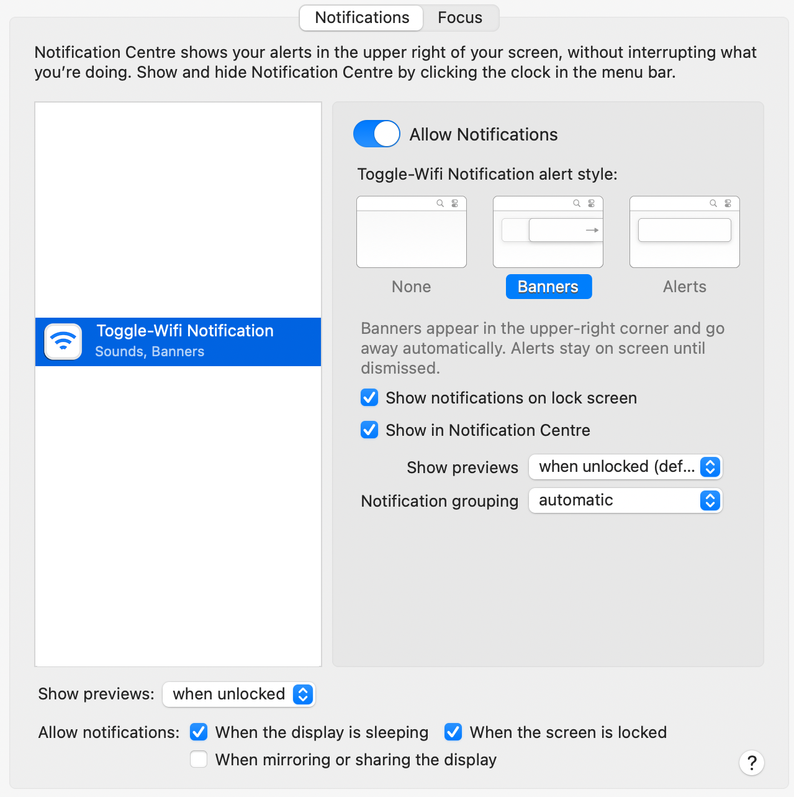

# Toggle-Wifi

Toggle-Wifi will turn off your Wifi connection if a ethernet adapter is active and turn it back on if there is no active ethernet adapter.
Notifiactions are realized using [dataJAR/Notifier](https://github.com/dataJAR/Notifier)


## Install

Toggle-Wifi will be installed as homebrew/tap.

```
brew tap mietzen/toggle-wifi update
brew install toggle-wifi
brew services start mietzen/toggle-wifi/toggle-wifi
```

## Turn On/Off Notifications

You can turn the Notifications On/Off via Notifications & Focus in System Prefrences:


